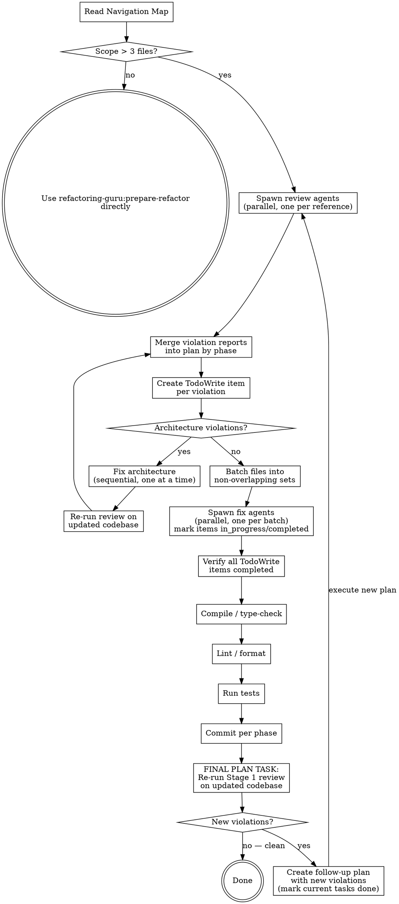

# Parallel Refactor

Orchestrates parallel sub-agent dispatch for refactoring large codebases. Use this skill when the refactoring scope covers multiple files and you want to speed up the process.

> **Prefer Agent Teams when available.** If the `CLAUDE_CODE_EXPERIMENTAL_AGENT_TEAMS` setting is enabled, use Claude Code's native agent teams (`TeamCreate` + `SendMessage` + shared task list) instead of `Task` tool subagents. Agent teams let teammates communicate directly, self-claim tasks, and coordinate through a shared task list — better suited for large refactors where review findings inform fix strategy. See https://code.claude.com/docs/en/agent-teams for details.
>
> **Fallback:** If agent teams are not enabled, use `Task` tool subagents as described below.

## Flow



## Prerequisites

Invoke `refactoring-guru:prepare-refactor` Stage 1a (Exploration) first. The exploration agent resolves the layered reference stack (project → user → plugin) and returns ABSOLUTE paths for `principles.md`, `elements/*.md`, and the applicable `architecture/*.md` files. Use those paths verbatim throughout this skill — do NOT resolve layers yourself.

If you already have an Exploration Report from an earlier stage of the same session, reuse it instead of re-running exploration.

## Sub-agent model: use Sonnet

All sub-agents spawned by this skill (review and fix) MUST run on Sonnet, not Opus. The task is bounded: rules come from reference files, violations are listed explicitly, and the work is mechanical pattern-matching and edits. Sonnet handles this well at a fraction of the cost.

- `Task` tool: pass `model: "sonnet"` in every sub-agent invocation.
- Agent teams (`TeamCreate`): set the team's model to `sonnet` when creating it.

The orchestrator (this conversation) stays on whatever model the user picked — only the dispatched workers switch to Sonnet.

## Stage 1: Review (parallel, read-only)

Spawn one **read-only** sub-agent per reference file (on Sonnet — see above). Each agent checks its rules against all code files in scope and produces a violation report.

**All review agents run in parallel.** They only read code — no conflicts possible.

### Per review agent prompt template

```
You are a code reviewer. Read this reference file:
- /abs/path/to/<language>/elements/<file>.md  (absolute path from Exploration Report)

For every ## heading in the reference, check ALL of these code files against that rule:
[list of code files in scope]

Output a violation report:
- For each rule (## heading), list which files violate it and how.
- If a file follows the rule, skip it.
- Do NOT fix anything. Read-only review only.
```

### After all review agents complete

Collect all violation reports. Merge them into a single plan grouped by phase:
1. Architecture violations
2. Elements violations (class body, method structure, method signature, error handling, concurrency)
3. Polish violations (naming, logging, documentation)

### Create TodoWrite tracking

Create a TodoWrite item for each violation found. Format: `"[phase] [rule] file.py:line"`. This tracks progress so interrupted sessions can resume from where they left off and agents don't redo completed work.

## Stage 2: Fix (parallel with constraints)

### Architecture fixes: SEQUENTIAL

Architecture changes (restructuring layers, moving files between packages, changing DI wiring) affect the structure that everything else depends on. Run these **one at a time, in order**.

Do NOT parallelize architecture fixes. Do NOT start Elements fixes until Architecture fixes are committed.

### Elements and Polish fixes: PARALLEL by file batch

Once architecture is stable, Elements and Polish fixes can run in parallel (on Sonnet — see "Sub-agent model" above) with one constraint:

**No two agents touch the same file.**

Batch the files into non-overlapping sets and dispatch one sub-agent per batch.

### How to batch

1. Count the files that need fixes
2. Choose the number of agents (recommended: 1 agent per 5-10 files, max 5 agents)
3. Assign each file to exactly one agent
4. Each agent gets ALL the violations for its assigned files (across all references)

### Per fix agent prompt template

```
You are refactoring these files:
[list of files assigned to this agent]

Before making changes, invoke the refactoring-guru:prepare-refactor skill,
OR read these references:
[list of relevant reference file paths]

Fix these violations:
[list of violations for this agent's files, grouped by reference]

For each fix:
1. Mark the violation as in_progress in TodoWrite
2. Read the rule from the reference
3. Fix the code to match
4. Verify the fix follows the rule exactly
5. Mark the violation as completed in TodoWrite

Do NOT touch files outside your assigned list.
```

### After all fix agents complete

1. Verify all TodoWrite items are marked completed — any remaining items indicate missed fixes
2. **Compile / type-check** the codebase. Mass refactoring frequently breaks signatures, imports, or types in ways tests do not catch (especially in Python where `mypy` is opt-in). If the project ships a build/type-check command, run it and fix any failures before continuing. Examples — adapt to the actual project: `./gradlew build` or `mvn compile` (Java), `mypy <package>` (Python), `tsc --noEmit` (TypeScript), `swift build` (Swift). If no such command is configured, note it in the summary and skip — do not invent one.
3. **Lint / format** the codebase. Mass refactoring often leaves unused imports, stale local variables, and formatting drift that a reviewer will bounce on PR. Run the project's configured linter and formatter, then auto-fix what is safe. Examples — adapt to the actual project: `ruff check --fix && ruff format` (Python), `./gradlew check` or `mvn verify -DskipTests` for Checkstyle/Spotless (Java), `eslint --fix && prettier --write` (TypeScript), `swiftlint --fix` (Swift). If lint reports issues that cannot be auto-fixed, fix them manually before continuing — do not commit lint failures.
4. Run tests to verify nothing is broken
5. Commit per phase (Elements commit, then Polish commit)

**Discovering the right commands:** Inspect project metadata before guessing — `Makefile`, `package.json` scripts, `pyproject.toml` `[tool.*]`, `build.gradle`, `pre-commit-config.yaml`, CI workflow files. Prefer the exact command the project's CI runs. If a layered reference (e.g. `<lang>/principles.md`) names verification commands, use those.

## Final plan task: Re-evaluate

**Every plan MUST include this as its last task.** This is what makes the loop work — it's not a suggestion to the agent, it's a concrete task in the plan that must be completed before the plan is considered done.

The last task in every plan must be:

```
Task: Re-evaluate codebase against all references
- Re-run Stage 1 (spawn review agents on the updated codebase)
- If ZERO violations found → mark this task complete. Done.
- If NEW violations found → create a follow-up plan:
  1. Mark all current plan tasks as completed
  2. Create a new plan with the new violations as tasks
  3. The new plan MUST also end with this same re-evaluate task
  4. Execute the new plan
```

### Why this works

- The loop is encoded as a **plan task**, not a behavioral instruction. Agents complete tasks — they don't reliably follow meta-instructions like "loop until clean."
- Each iteration is a fresh plan with concrete tasks. A new agent picking up the work sees "fix these 3 violations, then re-evaluate" — not "remember to loop."
- Previous tasks are marked completed, so no work is repeated.
- The re-evaluate task is self-replicating: every new plan includes it, so the loop continues until clean.

## Constraint Summary

| Action | Parallel? | Reason |
|--------|-----------|--------|
| Review: different reference files | Yes | Read-only, no conflicts |
| Fix: architecture changes | No | Structural, affects everything |
| Fix: elements/polish, different files | Yes | Independent file edits |
| Fix: same file by two agents | No | Edit conflicts |
| Re-evaluate (final plan task) | Yes | Same as Stage 1, read-only |

## Decision Tree

See the flow diagram at the top of this skill for the complete decision path.

## Embedding References in Sub-agent Prompts

Every sub-agent prompt MUST include full ABSOLUTE paths to the reference files it needs. Use the paths from the Exploration Report verbatim — sub-agents never resolve layers themselves.

```
Read these references first:
- /abs/path/to/<language>/elements/class_body.md
- /abs/path/to/<language>/elements/naming.md
```

Sub-agents don't inherit skill context. Without explicit paths, they skip rules.
