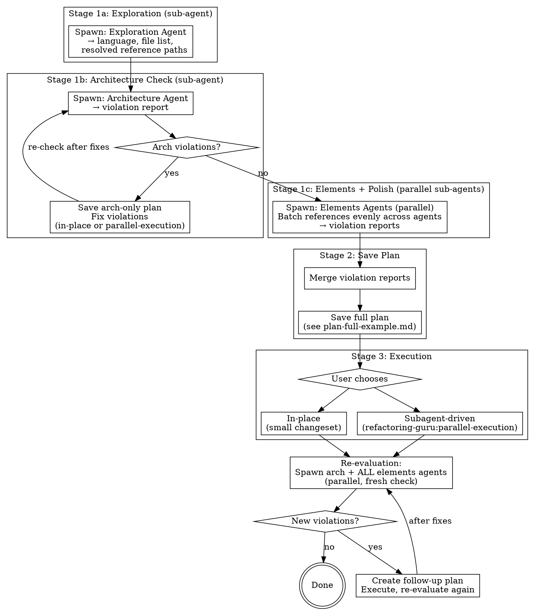
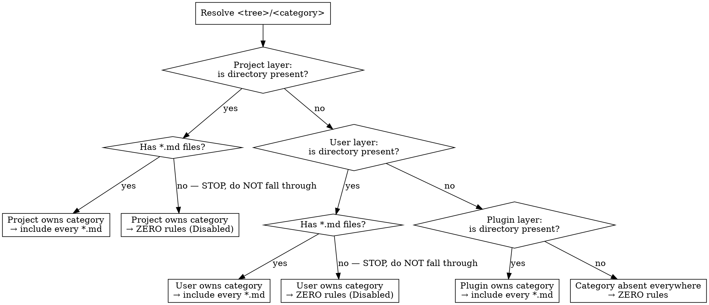

# Refactoring Guru

Methodology-driven refactoring with curated code standards. Works in three stages: review, plan, execute.

## Flow



## Layered References

Reference files are resolved from three layers (highest priority first):

1. **Project:** `$PROJECT_ROOT/.claude/refactoring-guru/references/`
2. **User:**    `$HOME/.claude/refactoring-guru/references/`
3. **Plugin:**  `${CLAUDE_PLUGIN_ROOT}/skills/prepare-refactor/references/`
   (fallback if env var missing: `ls -d $HOME/.claude/plugins/cache/*/refactoring-guru/*/skills/prepare-refactor/references/ | sort -V | tail -1`)

Each layer has the same shape:

```
references/
├── <language>/            # e.g. python, java, swift
│   ├── principles.md
│   ├── elements/*.md
│   └── architecture/*.md
└── common/                # language-agnostic rules (same sub-layout)
    ├── principles.md
    ├── elements/*.md
    └── architecture/*.md
```

**Resolution rule — directory-replace, per category.** For each logical path (`<tree>/principles.md`, `<tree>/elements/`, `<tree>/architecture/` where `<tree>` is the language name or `common`), walk the layers top-down. The first layer that contains the path owns it fully. If the path is a directory, ALL files inside belong to that layer — contents of the same directory in lower-priority layers are ignored. Resolution happens per category, so a project can override `python/elements/` without touching `python/architecture/` or `common/`.

**An empty owning directory means the category is disabled.** If the winning layer's `<tree>/<category>/` directory exists but contains no `*.md` files (only `.gitkeep`, or nothing at all), the category resolves to **zero rules**. Do **not** fall through to lower layers in this case — the empty directory is the explicit signal that this category should contribute nothing. This is how the `init-overrides` skill's **Disable** mode works. A common failure mode is treating an empty owning directory as "no content found, try the next layer" — that is incorrect and silently re-enables rules the user explicitly opted out of.



**No pattern detection.** The exploration agent includes every file inside the winning layer's `elements/` and `architecture/` directories. If you want different rules for different architectures, create another language-like tree (e.g. `frontend/`, `mobile/`) or put pattern-specific rules in `common/`.

**Adding rules** — drop files under `<layer>/<tree>/{principles.md, elements/*.md, architecture/*.md}` at the user or project layer. The exploration agent picks them up automatically; no plugin edits needed.

## Stage 1: Review (sub-agent driven)

Stage 1 is split into three sub-stages.

### Read User Context

Before doing anything else, extract from the user's message:
- **Scope** — which files, directories, or service to refactor
- **Steering** — any constraints, exclusions, or priorities (e.g. "don't touch error handling", "focus only on naming", "skip architecture fixes")

Carry both through to every sub-agent prompt you spawn. If scope is vague, ask the user to clarify before proceeding.

### Pre-check: Tests

Before spawning any sub-agents, verify:
- Tests exist for the code being refactored
- Run the test suite and confirm all tests pass (`pytest` for Python, `./gradlew test` or `mvn test` for Java)
- Check coverage — aim for >= 80% on files being refactored

If tests need work, record this in the plan and address it before proceeding with sub-agents.

### Stage 1a: Exploration Agent

> **Prefer Agent Teams when available.** If the `CLAUDE_CODE_EXPERIMENTAL_AGENT_TEAMS` setting is enabled, use Claude Code's native agent teams (`TeamCreate` + `SendMessage` + shared task list) instead of `Task` tool subagents. Create a team, add one task per element batch, and let teammates self-claim and coordinate through the shared task list. See https://code.claude.com/docs/en/agent-teams for details.
>
> **Fallback:** If agent teams are not enabled, use `Task` tool subagents as described below.

Read [prompts/exploration-agent.md](prompts/exploration-agent.md) for the full prompt template. Fill `[SCOPE AND STEERING FROM USER]` from the user's request, then spawn the sub-agent with that prompt.

The prompt walks the layered reference stack (project → user → plugin) per category and produces an Exploration Report with absolute paths. Categories that resolve to an empty owning directory are reported as `DISABLED at layer: <layer>` — downstream stages MUST treat those as zero references and never substitute plugin defaults.

Receive the Exploration Report. Use it to configure the next sub-agents.

### Stage 1b: Architecture Agent

Read [prompts/architecture-agent.md](prompts/architecture-agent.md) for the full prompt template. Fill placeholders with values from the Exploration Report (files in scope; the `<language>/architecture`, `<language>/principles`, `common/architecture`, and `common/principles` paths) and the user's original request, then spawn the sub-agent.

**After receiving the report:**
- If violations found → see "Architecture Violations" below
- If no violations → proceed to Stage 1c

#### Architecture Violations: Save Plan and Fix

If the Architecture Agent reports violations:

1. Read [plan-arch-example.md](plan-arch-example.md) for the plan format.
2. Save a plan to `docs/plans/YYYY-MM-DD-refactor-<scope>.md` with Stage 1b (Architecture) violations only.
3. Commit the plan file.
4. Offer execution (in-place or `refactoring-guru:parallel-execution`).
5. After fixes are applied, re-spawn the Architecture Agent with the same prompt on the updated files.
6. Repeat until the Architecture Agent reports no violations.
7. Then proceed to Stage 1c.

### Stage 1c: Elements Agents (parallel)

Spawn sub-agents **in parallel** using the Task tool. Each covers a subset of element references from BOTH `<language>/elements/` and `common/elements/` (if present). Decide the number of agents and how to batch references based on how many reference files the Exploration Report returned. Aim to balance work evenly across agents.

Read [prompts/elements-agent.md](prompts/elements-agent.md) for the per-agent prompt template. For each spawned agent, fill placeholders with the files in scope and that agent's assigned subset of reference paths, then send.

Wait for all agents to complete, then collect all violation reports.

## Stage 2: Save Plan

### Merge Violation Reports

Collect all violation reports from the Stage 1c elements agents. Merge them into a single violation list.

Phase labels come from [plan-full-example.md](plan-full-example.md) — read it to confirm the exact headings before grouping:
- Phase 3 covers structural element rules (class body, method structure, method signature, error handling)
- Phase 4 covers polish rules (naming, logging, documentation)

Group each agent's output into the appropriate phase based on which references it reviewed.

Then save the plan using the merged list. Read [plan-full-example.md](plan-full-example.md) for the full format.

**Save to:** `docs/plans/YYYY-MM-DD-refactor-<scope>.md`

### Architecture Changes Invalidate Later Phases

Architecture changes (moving files between packages, restructuring layers, changing DI wiring, splitting/merging classes) change the file layout. File paths and line numbers recorded during review for Stages 1c and 4 become unresolvable after architecture fixes.

**Rule:** If Stage 1b (Architecture) has any violations, do NOT include element or polish violations in the plan. Instead, add a **Stage 4 (Re-evaluate)** step that re-runs the review after architecture fixes are applied. See the flow diagram above for the complete decision path.

### Plan File Examples

The digraph above shows which phases to include. Read the matching example before writing the plan:

- **No architecture violations:** Read [plan-full-example.md](plan-full-example.md)
- **Has architecture violations:** Read [plan-arch-example.md](plan-arch-example.md)

**After saving:** Commit the plan file.

## Stage 3: Offer Execution

See flow diagram for the decision path. Present the user with:

| Option | When | How |
|--------|------|-----|
| **In-place** | Small changeset (user decides) | Work through plan phase by phase, commit after each |
| **Subagent-driven** | Larger changeset or >3 files | **REQUIRED:** Use refactoring-guru:parallel-execution |

## Stage 4: Re-evaluation

After all fixes from the plan are applied, re-run a full review to verify the codebase is clean.

Spawn all agents **in parallel** (same prompts as Stage 1b and 1c, same files in scope from the Exploration Report):
- Architecture Agent (Stage 1b prompt)
- Elements Agents (Stage 1c prompt, same batching as the original run)

**After collecting all reports:**

- **No violations** → done. Codebase is clean.
- **New violations found** → create a follow-up plan:
  1. Mark all current plan tasks as completed.
  2. Save a new plan file (`docs/plans/YYYY-MM-DD-refactor-<scope>-followup.md`) with the new violations.
  3. Offer execution.
  4. After fixes, re-run Stage 4 again.

The loop continues until re-evaluation finds zero violations.

## Writing Code (In-place Execution Only)

After writing or editing code, verify it against the relevant references using the same rule-by-rule process:

1. Read each relevant reference file
2. Create a checklist item for every `##` heading
3. Verify the code against each rule individually
4. Fix any deviations before moving on

If you haven't read the relevant reference yet, read it now.

## Embedding References

**Every plan step, TaskCreate task, and sub-agent prompt MUST include full reference paths.** Sub-agents don't inherit skill context — without explicit paths, they skip rules.

Use the ABSOLUTE paths from the Exploration Report verbatim. Sub-agents must never resolve layers themselves.

```
Step 2: Refactor the UserService class
References: /abs/path/to/<language>/elements/class_body.md
```

## Quick Reference

| Stage | What happens | Who does it |
|-------|-------------|-------------|
| Pre-check | Tests exist, coverage ≥ 80%, all passing | Main agent |
| 1a: Exploration | Language, files, resolved reference paths (language + common) | Exploration sub-agent |
| 1b: Architecture | Check arch refs rule-by-rule, report violations | Architecture sub-agent |
| 1c: Elements | Check element refs rule-by-rule, report violations | 3 parallel sub-agents |
| 2: Save Plan | Merge reports, save plan file, commit | Main agent |
| 3: Execute | In-place or `refactoring-guru:parallel-execution` | Main agent + user |
| 4: Re-evaluate | Re-run 1b + 1c in parallel, loop until clean | Main agent |
